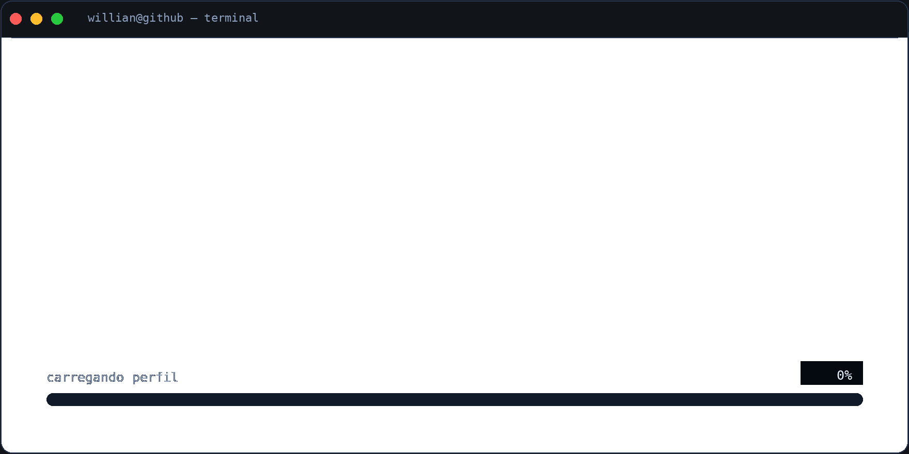

<!--  -->

 

 

  

 

<table>
  <tr>
  <td width="60%" valign="top">
    

      
    

  </td>

  <td width="40%" valign="top">
    
  </td>
  </tr>
</table>

 

 

  &nbsp;
  &nbsp;
  &nbsp;
  &nbsp;
  

 