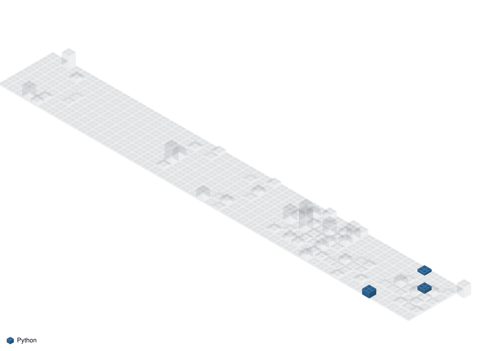

 

 

  
  
  
  
  
  
  
  
  
  
  
  
  
  
  
  
  
  
  
  
  
  
  
  
  
  
  

 

 

<!-- TODO: Implements customized github stats -->

<!-- <table>
  <tr>
  <td width="60%" valign="top">
    

      
    

  </td>

  <td width="40%" valign="top">
    
  </td>
  </tr>
</table> -->

 

 

  &nbsp;
  &nbsp;
  &nbsp;
  &nbsp;
  &nbsp;
  

 